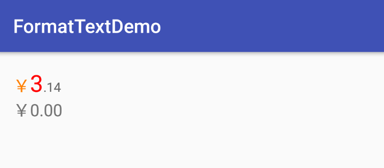

# FormatView
金额格式显示控件
### 效果图

### 使用方式
依赖
```
compile 'com.dongqing.formatview:formatview:1.0.0'
```
布局
```
<com.dongqing.formatview.FormatView
    xmlns:app="http://schemas.android.com/apk/res-auto"
    android:layout_width="wrap_content"
    android:layout_height="wrap_content"
    app:money="3.1415"
    app:prefix_color="#FF0000"
    app:prefix_size="25sp"
    app:suffix_color="#666666"
    app:suffix_length="2"
    app:suffix_size="14sp"
    app:symbol_color="#FF7F00"
    app:symbol_show="true"
    app:symbol_size="18sp"
    app:symbol_style="rmb" />
```
### 属性说明
| 属性|说明|
|:----:|:----:|
|symbol_show|是否显示金额符号|
|symbol_style|符号的类型[rmb(人民币)、dollar(美元)、yen(日元)、won(韩元)]|
|symbol_size|符号的大小|
|symbol_color|符号的颜色|
|prefix_color|前缀的(小数点前)颜色|
|prefix_size|前缀的大小|
|suffix_color|后缀的(小数点后)颜色|
|suffix_size|后缀的大小|
|suffix_length|保留几位小数（默认2位）|
|money|显示的金额|
### 代码设置
* setSymbolShow
是否显示金额符号
* setSymbolType
设置符号的类型
* setSymbolColor
设置符号的颜色
* setSymbolSize
设置符号的大小
* setPrefixColor
设置前缀的颜色
* setPrefixSize
设置前缀的大小
* setSuffixColor
设置后缀的颜色
* setSuffixSize
设置后缀的大小
* setSuffixLength
设置保留的位数
* setMoneyText
设置显示的金额

注意
setMoneyText必须最后支持，否则不生效。
### 最后
[我的博客](http://dongqing.website)
# License
`Apache License, Version 2.0`

